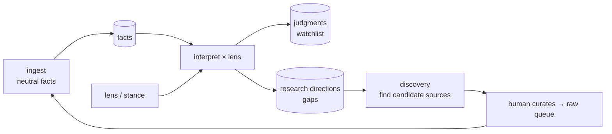
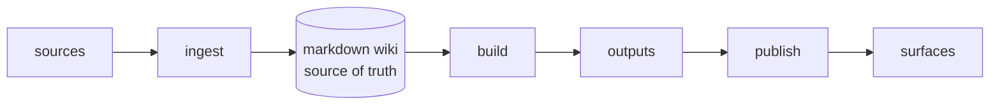
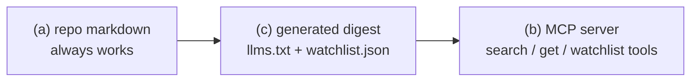

# Roadmap — Archivist

Strategic direction for the project. Phases here are a proposal, not a contract —
priorities can be reordered. Concrete, scheduled work items live in `TODO.md`.

---

## Vision

Archivist is a **git-native knowledge commons**. Sources arrive by PR (or on a schedule),
an agent ingests and evaluates them, and the resulting wiki is committed back — so both
people and local AI agents can consult a single shared brain of "what we generally know"
and "what's worth doing/using."

The first instance targets **AI research & things-to-watch**, but the engine stays
domain-agnostic. The AI focus is *content and configuration* (the profile), never baked
into the engine.

### One pipeline, one store, two audiences

- **Ingestion** — one pipeline, two triggers: a human dropping a link/repo in a PR, or a
  scheduled feed (e.g. an AI-article source) auto-ingesting with summaries.
- **Store** — the git repo of markdown is the single source of truth. It never changes shape.
- **Consumption** — two doors onto the same content:
  - *Humans* browse a published **docsify site (GitHub Pages)**.
  - *Agents* (local AI) read the **repo directly**, plus a machine-friendly digest and a
    lens-driven **watchlist** of actionable items.

### Facts, values, judgments (the interpretation model)

Archivist keeps three things deliberately separate, because they have different lifecycles:

- **Facts** (neutral) — what a source objectively says. Captured at **ingest**, permanent,
  audience-agnostic. Lives in the wiki pages.
- **Values** (a lens/stance) — what *we* care about (e.g. "budget grind: weight cost-efficiency
  and maturity; discount marginal SOTA gains"). Declared in `profile/lens.md`; changeable.
- **Judgments** (derived) — facts seen *through* a lens. Produced at **build time**, never at
  ingest, so they can be regenerated when the lens changes **without re-fetching anything**.

Because the lens is separate config, multiple lenses can sit over the same shared facts
(`lens/personal.md`, `lens/work.md`, `lens/studio.md`) → a different watchlist per audience
without duplicating knowledge. **Design for multi-lens; implement single-lens first.**

Interpretation produces **two** outputs from the same inputs (facts × lens):

- **Judgments** → the watchlist ("what we think of what we *have*").
- **Research directions** → gaps ("what we're *missing* that would be valuable"), which are
  themselves lens-dependent. Ingest can also emit *local* gap hints (e.g. "source cites
  technique Z, undocumented here").

This closes a flywheel — archivist points at its own blind spots:

Boundary that keeps it clean: archivist only ever *suggests* research directions (a derived
page in `docs/`); the **human curates** which become real pulls into `raw/`. This preserves
the founding rule — *the user curates sources; the agent does the filing* — and keeps `raw/`
sacred.

## Architecture

Four layers. Only the profile and content are domain-specific.

| Layer | Location | Role |
|-------|----------|------|
| **Engine** | `AGENTS.md`, `scripts/` | Domain-agnostic pipeline + orchestration |
| **Profile** | `profile/` | *What domain* — taxonomy, source types; *what we value* — lens/stance |
| **Extensions** | `extensions/` (planned) | *What capabilities* — pluggable stage handlers |
| **Content** | `raw/`, `docs/wiki/`, `.archivist/` | The knowledge + engine state |

### The pipeline & extension model

The engine is a thin pipeline; capabilities plug into its stages:

Three **extension kinds**, one per stage:

- **Source adapters** (ingest) — fetch + normalize one kind of source. The existing
  `fetch-url`, `clone-repo`, and `extract-pdf` scripts are already source adapters.
  Future: an arXiv/RSS adapter, and the AI-article feed (which can run on a schedule).
- **Builders** (build) — compile the wiki into artifacts. Includes the **interpretation
  builder** (facts × lens → judgments *and* research directions), the rubric-driven
  `watchlist.json`, a derived "Research Directions" page, and the agent-facing digest
  (`llms.txt` / `index.json`). Builders never mutate facts; they derive from them.
- **Publishers** (publish) — expose built artifacts on a surface. The **docsify site** is a
  publisher (serve locally for preview, deploy to GitHub Pages to share). A future **MCP
  server** is just another publisher that wraps the same digest.

Design intent (to be finalized in Phase 3):
- Each extension is a folder under `extensions/` with a small manifest declaring its
  `kind` (source | builder | publisher), entry point, config, and (for scheduled sources)
  a schedule.
- The engine discovers and runs enabled extensions by kind at the right stage.
- Extensions are additive: adding one never requires touching the engine.

### Agent-consumption staircase (decided)

Build the cheap, static rungs first; defer the server until the friction is real.

- **(a)** reading the repo markdown is the free floor.
- **(c)** a generated digest + watchlist is the near-term build (a *builder* extension).
- **(b)** MCP is a later *publisher* extension wrapping the same digest.

---

## Phases

### ✅ Phase 1 — Profile seam (done)
Domain specifics quarantined in `profile/`; engine reads the profile.

### ✅ Phase 2 — Ingest hardening (done)
Content-hash change detection (`.archivist/manifest.json`), Defuddle extraction, repo
refresh/diff, monorepo package detection, Mermaid rendering.

### Phase 3 — Pipeline & extension foundation
- Formalize the ingest → build → publish pipeline in the engine, with a clear **ingest =
  neutral facts / build = lensed judgment** contract.
- Define the extension manifest + discovery/registry and the three kinds.
- Retrofit `fetch-url` / `clone-repo` / `extract-pdf` as **source adapters** (no behavior change).
- Reframe the current docsify setup as the built-in **site publisher**.
- Split `profile/rubric.md`: keep *measurable dimensions* as facts captured at ingest; move
  *weighting + signal* (`adopt`/`trial`/`watch`) into a lens-driven interpretation concern.
- Introduce `profile/lens.md` (single lens now; structured so `lens/*.md` multi-lens is a
  drop-in later).
- Enabler phase; unlocks everything below.

### Phase 4 — Builders: interpretation, watchlist, research directions, digest
- **Interpretation builder** — reads neutral facts × the lens and emits derived outputs
  (re-runnable without re-ingesting):
  - **Watchlist** → `watchlist.json` + a "Recommendations & Watchlist" wiki page (`adopt` /
    `trial` / `watch`). The "actionable things to do/use" layer.
  - **Research directions** → a derived "Research Directions" page of lens-driven gaps
    (archivist *suggests*; the human curates which get pulled into `raw/`). Ingest may also
    emit local gap hints (undocumented cited concepts).
- **Digest builder** → `llms.txt` / `index.json`: a compact, machine-readable map of the wiki
  for local agents (the (c) door).

### Phase 5 — Site publisher → GitHub Pages
- Deploy the docsify site to GitHub Pages (the human door), serving the wiki + the digest.
- Keep local `serve` as the preview mode of the same publisher.

### Phase 6 — Automated ingestion
- **PR auto-ingest**: a GitHub Action runs the ingest stage when a PR adds/changes a source,
  commits the generated pages back onto the PR branch for review. (The headline "drop a link
  in a PR → it folds into the wiki" experience. Repo is now hosted, so this is unblocked.)
- **Scheduled AI-article feed**: a scheduled source adapter that ingests the article feed and
  writes summarized pages (optionally opening a PR for review).

### Phase 7 — MCP publisher (later)
- An MCP server exposing `search` / `get_page` / `list_watchlist` over the digest, so local
  AI in editors can query archivist directly. Build once the static digest proves insufficient.

---

## Backlog & future (unsequenced, but not forgotten)

Items with value that aren't yet slotted into a phase:

- **Proactive source discovery** *(future)* — a "research a subject" mode: archivist goes and
  *finds* candidate sources for a topic, registers them in a queue, then ingests them — rather
  than only ingesting sources handed to it. Consumes the human-curated **research directions**
  from the Phase 4 interpretation builder. Likely a 4th extension flavor (a "discovery"
  source) or a distinct mode.
- **Wiki information architecture** *(after transition)* — rework the sidebar/organization:
  wiki pages surfaced above technical/engine docs; decide where the log and guides live. The
  IA of the wiki as a reading experience.
- **Starter / seed source packs** *(low priority)* — bootstrap a fresh instance from a defined
  list of sources (e.g. an API/environment/repo set). Reinforces the re-instancing goal.
- **archivist-specific skills/agents** — an ingest agent, a lint agent, and the PR-ingest
  runner persona that ships with this repo. Becomes concrete at Phase 6. (The broader
  "use the best models / context-economy / lazy skill loading" tooling is studio-global
  infrastructure and lives outside this repo.)
- **`rtk` evaluation** *(speculative)* — assess [rtk](https://github.com/rtk-ai/rtk) for making
  LLM tool calls cheaper in the ingest/build agents. May or may not add value; evaluate before
  adopting.

---

## Open questions
- Extension manifest format and how enablement/config is declared.
- Which agent runner + model powers Phase 6 CI ingest, and cost/controls.
- The AI-article feed: what's the source, and how much summarization vs. full ingest.
- Do personal/work/studio all PR against this one repo, or is there a submission queue?
- Versioning sources that change upstream over time (partly handled by the manifest).
- Sequencing: Phase 6's PR auto-ingest is the marquee UX and could be pulled earlier if
  desired, ahead of builders/publishers.
