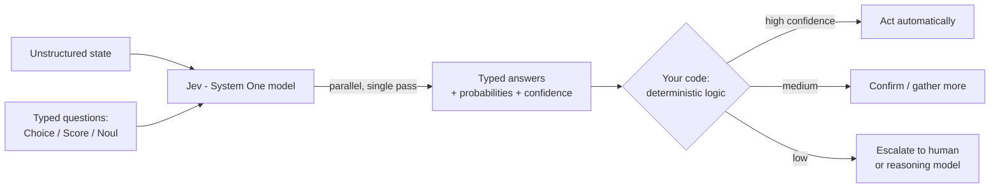

# Jev

## Summary

Jev is TypeSafe AI's flagship model and the first [System One Model](wiki/system-one-models.md).
Rather than generating human-readable text, Jev evaluates typed **questions** against a **state**
and returns typed values plus probability distributions that software can branch on, sort by, or
route with — "unstructured state in, typed probabilistic decisions out." It is optimized for
speed (70–500 ms), low cost, calibrated confidence, and guaranteed type-safety, at the cost of
free-form generation and (per independent analysis) frontier-level reasoning.

## Key Concepts

- **Function-call model** — input is unstructured state + a schema of questions; output is typed,
  probabilistic decisions in a single parallel forward pass (non-autoregressive).
- **Three primitives** (defined in the [docs](https://docs.typesafe.ai/)):
  - **Choice** — pick one option from a list → `choice`, `probabilities`, `confidence`.
  - **Score** — rate the state on a rubric/levels → `score`, `probabilities`, `confidence`.
  - **Noul** — is a statement true? → `noul` (0–1).
  - All three can be mixed in one API call; each question is evaluated independently and in
    parallel against the same state, so adding questions barely changes latency and avoids
    "context rot."
- **Calibrated confidence** — every Choice/Score answer carries a `confidence` (0–1) derived from
  the probability distribution; used to gate behavior (act / confirm / escalate) by risk.
- **Type-safety** — outputs conform to the schema by construction; the model cannot emit a value
  outside the defined space (0% type errors / schema hallucinations, by design).
- **Naming** — after William Stanley Jevons; TypeSafe expects the Jevons paradox to apply, with
  each drop in the cost of intelligence unlocking many more use cases.
- **Cardinality limit** — Choice supports up to 255 options; higher-cardinality choices use a
  two-stage score-then-choose approach.

## Details

### How it works in a workflow

The recommended pattern is **atomic questions composed in code**: instead of one broad question,
decompose it into well-scoped sub-questions, ask them together, then combine results with your
own logic and coefficients. This keeps each evaluation reliable and puts weighting/branching
under the developer's control.

### Reported performance and pricing

- **Latency:** 70 ms typical, 500 ms worst case (vs. seconds–minutes for frontier LLMs).
- **Pricing:** ~$0.042 / MTok input; output "too cheap to meter" (free).
- **Claimed advantage:** up to ~193× faster and ~444× cheaper on complex structured workflows
  (self-run evals; see [the launch post](wiki/jev-launch-typesafe.md)).
- **Access:** early access / waitlist via <https://typesafe.ai/>; service is West-Coast-based.
- **API/SDK:** `POST /v1/systemone` or client SDKs; default model id `jev-latest`.

### Skeptical view

[Sean Goedecke](wiki/jev-structured-output-goedecke.md) argues Jev's benefits (speed, parallelism,
type-safety) are largely reproducible with existing LLMs via prefill + single-token constrained
decoding, that "can't hallucinate" is a semantic claim (Jev can still pick the wrong option), and
that without test-time compute this class likely caps near non-reasoning-LLM intelligence. See
[Structured Output](wiki/structured-output.md) for the underlying technique debate.

## Related Pages

- [System One Models](wiki/system-one-models.md)
- [TypeSafe AI](wiki/typesafe-ai.md)
- [Structured Output](wiki/structured-output.md)
- [Introducing System One Models & Jev (TypeSafe AI)](wiki/jev-launch-typesafe.md)
- [Jev means structured output is interesting again](wiki/jev-structured-output-goedecke.md)

## Sources

- TypeSafe launch post: <https://typesafe.ai/blog/introducing-system-one-models-and-jev>
- Sean Goedecke analysis: <https://www.seangoedecke.com/jev-means-structured-output-is-interesting-again/>
- TypeSafe docs: <https://docs.typesafe.ai/> · Confidence: <https://docs.typesafe.ai/confidence>
