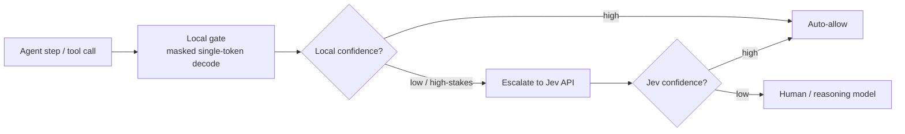

# Local Guardrails with System One Models

## Summary

An architecture note on using fast structured-decision models as **boundaries around other AI
agents** — gating tool calls, filtering inputs/outputs, and routing — in a strictly on-prem
stack. It covers where [Jev](wiki/jev.md) fits, how to build a local "Jev-lite" today with the
[Goedecke prefill + constrained-decoding pattern](wiki/structured-output.md), the calibration
caveat that this pattern does *not* solve for free, and a **hybrid** design that keeps the
high-volume gate local while escalating only ambiguous cases to Jev's API. Written as guidance,
not a benchmark.

## Key Concepts

- **Guardrail = a fuzzy if-statement, not a chatbot.** Ask atomic, typed questions and branch in
  code; keep the model out of free-form generation on the critical path.
- **Confidence-gated autonomy.** Divide behavior by certainty: high → auto-allow, medium →
  confirm, low → escalate. Thresholds scale with the stakes of each action.
- **Type-safe ≠ correct.** Constraining outputs to a schema removes malformed/out-of-schema
  decisions but not *wrong* ones — the boundary can still pick the unsafe option.
- **Calibration is the real work item.** Raw local logits are not guaranteed calibrated; earning
  trustworthy confidence needs a small labeled set + temperature/Platt scaling.
- **Hybrid escalation.** Run the cheap gate on-prem for every step; call out to Jev only when
  local confidence is low — cheap because guardrail inputs are tiny and Jev output is free.

## Details

### Where a boundary model slots in

- **Inline gatekeeper on tool calls** — before an agent action executes, ask e.g.
  `Noul: is this destructive?`, `Noul: does this violate policy X?`, `Choice: risk tier?`, and
  branch. Cheap + low-latency enough to run on *every* step (the usual blocker for LLM guardrails).
- **Pre/post filters** — score inputs for prompt-injection and outputs for PII/tone/leakage as
  separate questions, combined with your own logic.
- **Router** — a `Choice` that dispatches a request to the right sub-agent, tool, or model.

The structural win for a boundary specifically: because a constrained model can't emit an
out-of-schema value, a `should_proceed` decision can't itself become a malformed blob buried deep
in a dependency chain — the failure mode the [launch post](wiki/jev-launch-typesafe.md) calls out
for latency-guaranteed systems.

### Building a local "Jev-lite" (on-prem, today)

The [Goedecke pattern](wiki/jev-structured-output-goedecke.md): prefill the prompt, generate a
**single** token under a logit mask restricted to the allowed choices, and read the logprobs.
Supported by common local servers — **vLLM** (`guided_choice` + `logprobs`), **llama.cpp** (GBNF
grammars + logprobs), **TGI** (grammar/JSON constraints).

Mapping the [TypeSafe primitives](wiki/system-one-models.md) onto it:

- **Choice** → mask to option tokens, sample 1 token. Keep it truly single-pass by mapping
  choices to distinct single tokens (`A/B/C` or `1/2/3`) rather than long strings.
- **Noul** (yes/no) → single-token `true`/`false`, take the logprob.
- **Score** → constrain to a small set of levels and take the expected value over level
  probabilities.
- **Confidence** → softmax over the masked logits; batch multiple independent questions in one
  inference call.

This buys three of Jev's four properties essentially for free: **speed** (masked single-token
decode is a few ms on a local GPU), **type-safety** (guaranteed by the mask), and **parallelism**.
Marginal cost is your existing hardware.

### The calibration caveat

The property you do **not** get for free is *calibrated* confidence. Raw logits can be over- or
under-confident, so thresholds may not mean what you assume. The fix is a thin calibration layer:
collect a few hundred labeled examples, measure calibration (ECE / a reliability diagram), and
apply temperature (or Platt) scaling. This is exactly what Jev claims RLCD provides out of the
box — so it is the sharpest place to compare local-vs-Jev quality.

<!-- gap: validate calibration quality of local single-token constrained decoding (ECE / reliability) vs. Jev before trusting confidence thresholds for high-stakes gates. -->

### Hybrid design (respects the on-prem-for-cost driver)

Run the local gate on every step (free, high volume); escalate only ambiguous or high-stakes
cases to Jev. Because guardrail inputs are small (state + a few questions) and Jev's output is
free at ~$0.042/MTok input, the paid slice stays tiny. Logging local-vs-Jev agreement also gives
a free A/B on whether Jev's calibration edge justifies more traffic.

### Watch-outs

- It is a **gut-check, not a reasoner** (no test-time compute) — keep a slower model as the
  escalation path for sophisticated adversarial analysis.
- **Decompose** questions ("destructive?", "policy-violating?", "injection?") instead of one broad
  "is this safe?".
- Jev is a **hosted API** (currently West-Coast) — not local; treat it as the escalation brain,
  not the whole system.

## Related Pages

- [Jev](wiki/jev.md)
- [System One Models](wiki/system-one-models.md)
- [Structured Output](wiki/structured-output.md)
- [Introducing System One Models & Jev (TypeSafe AI)](wiki/jev-launch-typesafe.md)
- [Jev means structured output is interesting again](wiki/jev-structured-output-goedecke.md)

## Sources

- TypeSafe launch post: <https://typesafe.ai/blog/introducing-system-one-models-and-jev>
- Sean Goedecke analysis: <https://www.seangoedecke.com/jev-means-structured-output-is-interesting-again/>
- TypeSafe docs — Confidence: <https://docs.typesafe.ai/confidence>
- Synthesized in conversation, 2026-09-16.
